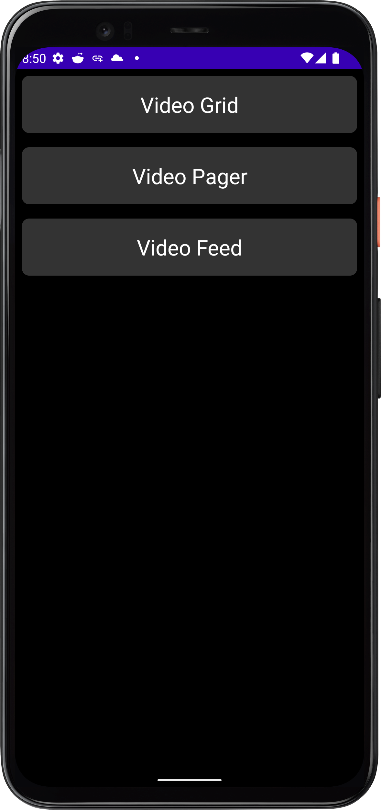
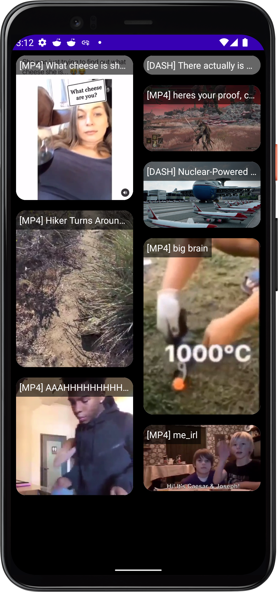

# Player Prototyping

This is a dev app used to try out different video playback
configurations within a few different popular user interfaces:

 1. A basic feed containing videos (like Reddit's Home Feed)
 2. A swipe-able, paginated list of videos (like Reddit's Full Bleed Video Player)
 3. A grid of videos, with multiple columns, like Reddit's Discovery surface.

One goal of this app will be to get down a single ExoPlayer instance
that can be intelligently attached/detached from the various surfaces.
To do so on the pager and list views, we will use a still image to
populate the surfaces while they are not attached to active video. The
grid view will instead use a carousel of images to simulate video
playback; it won't use ExoPlayer at all.

